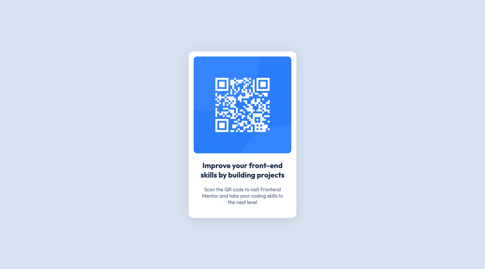

# **Frontend Mentor - QR code component solution**

This is a solution to the [QR code component challenge on Frontend Mentor](https://www.frontendmentor.io/challenges/qr-code-component-iux_sIO_H).

## Table of Content

- [Screenshot](#screenshot)
- [Links](#links)
- [My Process](#my-process)
- [Build With](#built-with)
- [What I Learned](#what-i-learned)
- [Author](#author)

## Screenshot



## Links

- [Solution URL](https://github.com/ionStici/qr-code-component)
- [Live Site URL](https://ionstici.github.io/qr-code-component)

## Built With

- HTML and CSS

## What I Learned

Two ways of adding an image on a web page:

- Using the `` html tag
- Through `background-image` CSS Property

```HTML
<div
    style="background-image: url(./img.jpg);"
    role="img"
    aria-label="QR Code"
>
```

We should use the `role` and `aria-label` attributes to kind of provide information about the empty tag to screen readers, like `alt` attribute does (probably).

Besides this, I found out what a cool tool Figma is 👨‍🎨

Firefox 🦊, it really surprised me how easily we can screenshot web pages.

<br>

## Author

- [GitHub](https://github.com/ionStici)
- [Frontend Mentor](https://www.frontendmentor.io/profile/ionStici)
- [Twitter](https://twitter.com/IonStici3)
